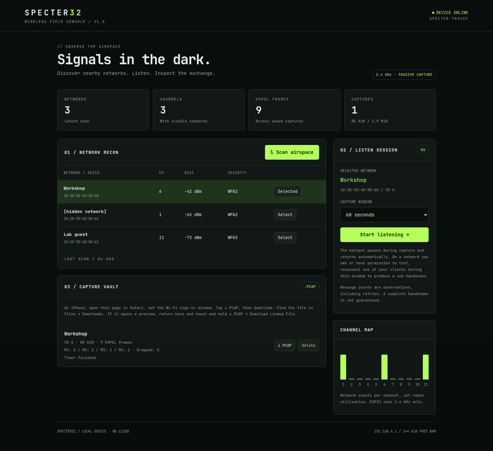

# SPECTER32

A pocket-sized passive Wi-Fi field console for **ESP-WROOM-32 / ESP-32S development boards with 4 MB flash**. The board creates its own password-protected hotspot and serves an offline, dark green dashboard to your phone.



## What it does

- Passive discovery of nearby 2.4 GHz networks: SSID, BSSID, signal strength, security mode and channel. Hidden networks appear without a name.
- Channel map showing network counts, and a timed listener for a selected BSSID.
- Saves that network's beacons/probe responses and unencrypted EAPOL frames to standard `.pcap` files. It waits for naturally occurring authentication traffic.
- Shows observed M1–M4 message counts, EAPOL frames, queue drops and capture size. Counts include retransmissions and multiple clients; **they do not certify a complete or usable handshake**.
- Downloads and deletes captures from your phone. Everything, including the web app, lives on the ESP32. No CDN, internet, SD card or additional wiring required.

Use on networks you own or have permission to inspect. This is a passive capture tool; it does not send deauthentication frames, inject packets, or crack passwords.

## The single-radio tradeoff

This board has one 2.4 GHz radio. It cannot maintain a reliable hotspot on one channel while continuously listening on another. SPECTER32 uses two modes:

1. **Dashboard:** hotspot, passive multi-channel scan and file downloads. Scanning may briefly delay dashboard requests.
2. **Listen:** the hotspot pauses, the radio locks to the selected network's channel for 15–300 seconds, and packets are saved locally. After the timer or size limit, the hotspot returns. Reconnect your phone to finish downloading.

There is no live browser update or browser stop button during listening. The page keeps a local countdown and resumes polling when reconnected. A reset stops capture immediately but can leave an incomplete final PCAP record. Default regulatory configuration is **US, channels 1–11**. Change `setCountry()`, `FIRST_CHANNEL`, `CHANNEL_COUNT` and the dashboard channel labels together for another region.

This is not a full Linux monitor-mode adapter or an airmon-ng replacement. It cannot see 5/6 GHz networks, decrypt protected frames, or guarantee reception of every handshake message. WPA3 SAE authentication is not captured by this EAPOL-focused collector. Open networks do not have WPA handshakes. A quiet network may produce only beacons or an empty file.

## Flash the ready-built firmware

Download `downloads/specter32-merged.bin` from this private repository. Install Python and esptool, connect the board using a **USB data cable**, and run:

```sh
python -m pip install esptool==4.11.0
python -m esptool --chip esp32 --port /dev/ttyUSB0 --baud 460800 write_flash 0x0 downloads/specter32-merged.bin
```

Use your actual port (`COM3` on Windows, for example). If connection fails, hold **BOOT**, tap **EN**, then release BOOT once flashing begins. Lower the baud rate to `115200` if needed. The merged image includes bootloader, partition table and application; its padded region also clears NVS, so it is intended for initial installation and regenerates the hotspot password. The application formats its LittleFS partition on first provisioning if it cannot mount it. Back up any previous device contents before replacing other firmware.

For SPECTER32 application updates that preserve credentials and captures, use PlatformIO upload below, or flash `downloads/firmware.bin` at `0x10000` with the existing SPECTER32 partition table. Do not use `uploadfs`: the dashboard is embedded in the application and the filesystem holds your captures.

## Connect from a phone

1. Open a serial monitor at **115200 baud** and tap EN/reset. You can use `pio device monitor -b 115200` after installing PlatformIO. The board prints its `SPECTER-xxxxxx` Wi-Fi name and a random 16-character password. The password persists across normal resets and app-only updates.
2. Join that hotspot on your phone. Accept **stay connected without internet** if prompted. Keep the password private: devices on this hotspot can view and download captures.
3. Open **http://192.168.4.1** in your normal browser. If a captive-portal mini-browser opens, use Safari/Chrome instead for reliable downloads.
4. Tap **Scan airspace**, select your network, choose a duration, and tap **Start listening**.
5. While the board listens, reconnect another client you control to that network to generate authentication traffic. Keep the ESP32 near both the AP and client.
6. When the countdown finishes, rejoin the SPECTER hotspot and return to the dashboard. Tap **↓ PCAP** in the capture vault, then **Download** if Safari asks. Find the file in the Files app under Downloads (On My iPhone or iCloud Drive, depending on Safari settings). If a preview appears, return to the dashboard and touch and hold **↓ PCAP**, then choose **Download Linked File**. Use the full Safari app, not the Wi-Fi sign-in window. Keep your phone on this Wi-Fi even though it has no internet.

Downloads use a `.pcap` URL, a binary attachment response and an explicit filename. The file is already PCAP; do not rename it to `.pcapng` (that is a different format). Viewing binary packets as text produces random-looking characters and does not itself indicate a corrupt capture.

Open the file in Wireshark, with the display filter `eapol`, to inspect the exchange. PCAP timestamps are **relative to the capture start**, not wall-clock dates. Records use link type 105 (raw IEEE 802.11), little-endian PCAP headers and no FCS/radiotap. There is no per-packet RSSI/channel metadata; the capture summary identifies the fixed channel.

## Build from source

```sh
python -m venv .venv
# Linux/macOS; on Windows use .venv\Scripts\activate
source .venv/bin/activate
python -m pip install platformio==6.1.18
pio run
pio run -t upload --upload-port /dev/ttyUSB0
pio device monitor -b 115200
```

The `esp32dev` target uses the classic ESP32, a 2 MiB application partition and roughly 1.94 MiB of LittleFS. No PSRAM is required. ESP32-S2/S3/C3 boards need a different configuration and are not the target of this build. PlatformIO automatically compresses and embeds `web/index.html` before building.

## Storage and implementation

- Up to six saved sessions, capped at 256 KiB each. Full storage rejects a new capture; it never silently deletes old captures. Download and delete a session to make room.
- The radio callback validates frame bounds, filters by BSSID, retains at most one beacon/probe response per second and queues frames with zero wait. The main loop writes flash outside the Wi-Fi task. Queue-full drops are reported; oversized, encrypted, fragmented, malformed, WDS and aggregated A-MSDU frames are excluded.
- A 24-frame queue consumes about 39 KiB of dynamic memory. The dashboard reports remaining heap. Network results are capped at 64 entries per scan.
- Later filesystem mount failures disable capture instead of automatically formatting stored files. Power-loss captures remain downloadable with a recovery label when no summary was committed. Interrupted metadata is written to a temporary file and renamed only after closing.
- Mutating API calls require a per-boot token in a custom header; cross-origin access is not enabled. SSIDs are rendered as text, never HTML. Non-ASCII SSID octets are represented bytewise and may not display as the original Unicode name.
- Passwords are stored in device NVS. PCAPs remain in local flash until deleted. HTTP access relies on the WPA2 hotspot for access control; there is no separate dashboard login or flash encryption.

## Tests and validation

```sh
bash tools/test.sh
npm ci
npx playwright install chromium
npm run test:web
pio run
```

The host suite requires GCC, Python and Node. It tests M1–M4 classification, QoS/HT headers, every truncation of sample frames, malformed/filtered inputs, 100,000 randomized parser inputs under AddressSanitizer/UBSan and independent PCAP framing. Browser tests exercise mobile layout, untrusted SSIDs, selection, slow scan requests, downloads, deletion, capture state and page reload. Browser tests use **simulated device data**, including the screenshot above.

**Validated here:** successful ESP32 firmware build, host sanitizer/PCAP tests, and Chromium dashboard tests. **Not yet validated on physical hardware:** radio reception, hotspot recovery, flash endurance and actual phone Wi-Fi reconnection. No ESP32 was attached during development.

Hardware acceptance: flash a spare board; verify scan results against your AP; select that AP, reconnect an owned client during capture, verify EAPOL frames in Wireshark, check hotspot recovery, power-cycle to verify persistence, and exercise download/delete and full-storage behavior. Avoid disconnecting power during flash writes.

Reference: [Espressif Wi-Fi API and packet metadata](https://docs.espressif.com/projects/esp-idf/en/v4.4/esp32/api-reference/network/esp_wifi.html), [sniffer mode and callback guidance](https://docs.espressif.com/projects/esp-idf/en/latest/esp32/api-guides/wifi-driver/wifi-modes.html).
